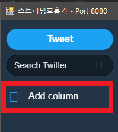
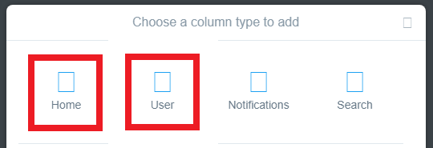
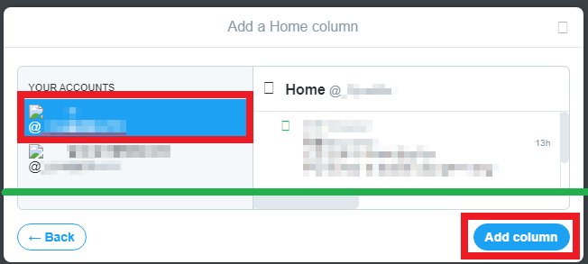
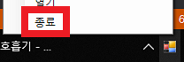
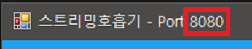
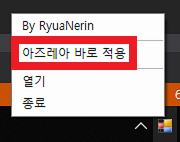
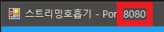

# 스트리밍 호흡기 (beta)

- 이제는 없어져버린 스트리밍을 트윗덱을 이용하여 비슷하게나마 사용 가능하게 해줍니다
- 버그 및 건의사항은 아래 방법으로 연락주세요.

## 목차

- [LICENSE](#)
- [사용 방법](#)
  - [아즈레아 적용법 (아즈레아 설정)](#)
  - [아즈레아 적용법 (1회성 적용)](#)
  - [기타 앱 적용 방법](#)

## LICENSE

- 이 프로그램은 [GNU GENERAL PUBLIC LICENSE v3](LICENSE) 로 배포되며
- 사용된 오픈소스 라이브러리에는 이 라이선스가 적용되지 않을 수 있습니다.
- 이 프로그램으로 인한 모든 결과의 책임은 사용자에게 있습니다.

## 사용 방법

1. [여기](https://github.com/RyuaNerin/StreamingRespirator/releases/latest) 에서 프로그램을 다운로드합니다.

  - 파일 용량이 매우 큰 관계로 다운로드에 오랜 시간이 걸릴 수 있습니다
  

2. **1** 에서 다운로드한 파일의 압축을 풀고 `StreamingRespirator.exe` 파일을 실행합니다.

3. 이런 창이 뜨면 **예(Y)** 눌러줍니다. (1회만 뜸)

  

4. 트위터 로그인을 진행합니다.

5. `Add Column` 을 눌러 스트리밍을 사용하려는 계정의 `Home` 과 `User` 를 추가해줍니다.

  - Home 만 추가해줘도 되지만 Activity 를 추가해주지 않으면 멘션이 제대로 오지 않을 수 있습니다.
  - **원활한 사용을 위해 이미지 사용 기능이 꺼져있습니다**

  
  
  

6. 아래 연결 방법을 이용하여 스트리밍 호흡기에 연결하시면 됩니다.
  - [아즈레아 적용법 (아즈레아 설정)](#)
  - [아즈레아 적용법 (1회성 적용)](#)
  - [기타 앱 적용 방법](#)

7. 창을 닫아도 프로그램이 종료되지 않으며 트레이 (하단 시계 옆) 에서 작동합니다.

8. 종료하려면 트레이 아이콘을 마우스 우클릭한 후 `종료`를 눌러줍니다.

  

### 아즈레아 적용 방법 (아즈레아 설정)

아즈레아 내부 설정으로 적용함으로, 1회성 적용과는 다르게 아즈레아 재 시작시에도 유지됩니다.

1. 창 이름 끝에 붙어있는 `Port ****` 에서 숫자 부분을 확인합니다.

  

2. 아즈레아 설정창을 엽니다

  

3. 아래 그림과 같이 설정합니다. **포트** 부분에는 상단 ` 1 ` 에서 확인한 숫자를 입력해야 합니다.

  

### 아즈레아 적용 방법 (1회성 적용)

트레이 아이콘을 우클릭 하신 후 `아즈레아 바로 적용` 을 눌러줍니다.

- 적용은 아즈레아 종료시까지 유지됩니다

  

### 기타 앱 적용 방법 (앱에서 프록시 사용이 가능해야 함)

- 이 기능은 앱에서 **프록시** 기능을 설정할 수 있어야 합니다.

- 프록시 기능을 지원하지 않는 프로그램에 대해서는 문의주시면 검토해보도록 하겠습니다.

1. 프로그램 창 이름 끝에 붙어있는 `Port ****` 에서 숫자 부분을 확인합니다.

  

2. 프록시 설정에 아래와 표와 같이 입력합니다.

  |항목|값|
|:-:|---|
|주소|127.0.0.1|
|포트|`1` 에서 확인한 숫자|
|사용자명|(공란)|
|비밀번호|(공란)|

