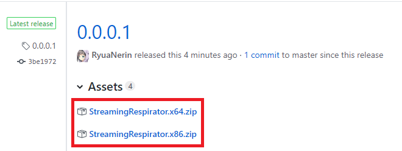
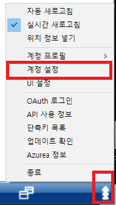
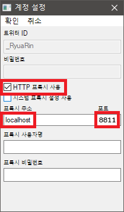

# 스트리밍 호흡기

- 이제는 없어져버린 스트리밍에 호흡기를 달아 비슷하게나마 사용 가능하게 해줍니다

- 스트리밍 호흡기를 연결하면 예전에나 사용 가능했던 **`d @BLABLA TEXT` 로 DM 보내는게 다시 가능합니다!!**
  - **`pbs.twimg.com` `video.twimg.com` 연결 시 스트리밍 호흡기 프록시를 활용해야 합니다.**

- **트위터 이미지 로딩 속도 개선 패치가 포함되어 있습니다. (한국 유저 대상)**
  - OS 언어가 한글일 때 자동으로 활성화됩니다.
  - 설정에서 비활성화하실 수 있습니다.
  - 관련 문서는 [여기](https://github.com/RyuaNerin/DNS-For-Twimg) 를 참조해주세요.

- 버그 및 건의사항은 아래 방법으로 연락주세요.
  - [Github Issues](https://github.com/RyuaNerin/StreamingRespirator/issues)
  - [Twitter @RyuaNerin](https://twitter.com/RyuaNerin)
  - [Telegram @unknown5766](https://t.me/unknown5766)

## 설명서 업데이트중입니다

## 목차

- [LICENSE](#license)
- [사용 방법](#사용-방법)
  - [계정 추가 방법](#계정-추가-방법)
  - [아즈레아 적용법](#아즈레아-적용-방법)
  - [기타 앱 적용 방법](#기타-앱-적용-방법)
- [개발중인 앱에 연결](#개발중인-앱에-연결)

## LICENSE

- 이 프로그램은 [GNU GENERAL PUBLIC LICENSE v3](LICENSE) 로 배포되며
- 사용된 오픈소스 라이브러리에는 이 라이선스가 적용되지 않을 수 있습니다.
- 이 프로그램으로 인한 모든 결과의 책임은 사용자에게 있습니다.

## 사용 방법

1. [여기](https://github.com/RyuaNerin/StreamingRespirator/releases/latest) 에서 프로그램을 다운로드합니다.

  

2. **1** 에서 다운로드한 파일의 압축을 풀고 `StreamingRespirator.exe` 파일을 실행합니다.

3. 우측 하단 트레이 아이콘을 우클릭 한 후 계정을 추가해주세요.

4. 트위터 클라이언트를 실행 후, 하단 연결 방법을 참조하여 스트리밍에 연결합니다.

- 작동 테스트 된 클라이언트
  - 아즈레아 (v1.4.33)
  - 달새 mk.2
  - 달새 mk.3

### 계정 추가 방법

- **TODO**

1. Chrome 을 실행합니다.

1. 쿠키 추출을 위해 [확장 프로그램 (Get cookies.txt)](https://chrome.google.com/webstore/detail/get-cookiestxt/bgaddhkoddajcdgocldbbfleckgcbcid) 을 설치합니다

1. [여기](chrome://extensions/) 로 이동한 후 `Get cookies.txt` 를 찾아 클릭합니다

1. 시크릿 모드에서 확장 프로그램을 사용하기 위해서 **시크릿 모드에서 허용** 을 체크합니다

1. 시크릿 모드 창을 생성합니다 (`Ctrl + Shift + N`)

1. [TweetDeck](https://tweetdeck.twitter.com/) 에 로그인합니다

1. `Get cookies.txt` 확장 프로그램을 클릭합니다

1. `Export` 버튼을 클릭하여 쿠키를 다운로드합니다

1. **화면 우측 하단 트레이 아이콘**을 **우클릭** 한 후 **계정 추가**를 클릭합니다

1. **쿠키 파일 선택** 을 클릭한 후, 5번에서 받은 파일을 선택합니다

- **EditThisCookie** 등의 확장 프로그램도 사용이 가능합니다.

- 지원 타입
  - Json
  - Netscape HTTP Cookie
  - Semicolon separated name=value pairs

### 아즈레아 적용 방법

1. 아즈레아 설정창을 엽니다

  

2. 아래 그림과 같이 설정합니다.

  

3. 아즈레아를 재시작 합니다.

### 기타 앱 적용 방법

- 이 기능은 앱에서 **프록시** 기능을 설정할 수 있어야 합니다.

  |항목|값|
  |:-:|---|
  |주소|127.0.0.1|
  |포트|8811|
  |사용자명|(공란)|
  |비밀번호|(공란)|

## 개발중인 앱에 연결

- 스트리밍 호흡기는 다음 두 가지 방법으로 연결하여 사용할 수 있습니다
1. HTTP 프록시 사용
  - 아래 두 연결을 사용할 때 스트리밍 호흡기의 포트에 맞게 proxy 설정을 해주세요.
  	- `https://streaming.twitter.com`
    - `https://api.twitter.com`
  - 프록시 아이디 혹은 비밀번호가 설정된 경우
    - HTTP 표준에 따라 `Proxy-Authorization` 헤더를 설정해주어야 합니다.
    - 인증 방식 : `Basic`

2. 직접 연결
  - 프록시 사용이 불가능할 때 다음과 같이 사용하실 수 있습니다.
    - `https://userstream.twitter.com/A/B/C` →
      - `http://127.0.0.1:<port>/userstream.twitter.com/A/B/C`
      - `https://localhost:<port>/userstream.twitter.com/A/B/C`
    - `https://api.twitter.com/A/B/C` →
      - `http://127.0.0.1:<port>/api.twitter.com/A/B/C`
      - `https://localhost:<port>/api.twitter.com/A/B/C`

- 스트리밍 호흡기에 프록시 아이디와 비밀번호가 설정된 경우, 프록시 인증이 필요할 수 있습니다.
  - 프록시 사용 시
    - 아래 호스트 연결 시 클라이언트 인증을 요구합니다. (`407 Proxy Authentication Required`)
      - `streaming.twitter.com`
      - `api.twitter.com` 
    - 대부분의 HTTP 라이브러리에서 인증 기능을 제공합니다.
    - 해당 기능을 제공하지 않는 라이브러리 사용 시 **직접 연결 시** 와 같이 사용해주세요.
  - 직접 연결 시
    - 다음과 같은 방식으로 `Proxy-Authorization` 헤더를 생성해주세요.
    - `Proxy-Authorization: Basic <credentials>`
      - `<credentials>` : base64(`"<id>:<pw>"`)

- 참고 문서
  -  [	HTTP/1.1: Authentication (`RFC 7235, section 4.4: Proxy-Authorization`)](https://tools.ietf.org/html/rfc7235#section-4.4)
  -  [	The 'Basic' HTTP Authentication Scheme (`RFC 7617`)](https://tools.ietf.org/html/rfc7617) 
