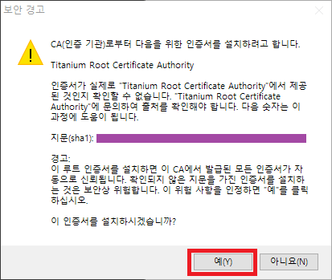

# 스트리밍 호흡기

- 이제는 없어져버린 스트리밍에 호흡기를 달아 비슷하게나마 사용 가능하게 해줍니다

- 스트리밍 호흡기를 연결하면 예전에나 사용 가능했던 **`d @BLABLA TEXT` 로 DM 보내는게 다시 가능합니다!!**

- 버그 및 건의사항은 아래 방법으로 연락주세요.
  - [Github Issues](https://github.com/RyuaNerin/StreamingRespirator/issues)
  - [Twitter @RyuaNerin](https://twitter.com/RyuaNerin)
  - [Telegram @unknown5766](https://t.me/unknown5766)

## 설명서 업데이트중입니다

## 목차

- [LICENSE](#license)
- [사용 방법](#사용-방법)
  - [아즈레아 적용법](#아즈레아-적용-방법)
  - [기타 앱 적용 방법](#기타-앱-적용-방법)
- [개발중인 앱에 연결](#개발중인-앱에-연결)

## LICENSE

- 이 프로그램은 [GNU GENERAL PUBLIC LICENSE v3](LICENSE) 로 배포되며
- 사용된 오픈소스 라이브러리에는 이 라이선스가 적용되지 않을 수 있습니다.
- 이 프로그램으로 인한 모든 결과의 책임은 사용자에게 있습니다.

## 사용 방법

1. [여기](https://github.com/RyuaNerin/StreamingRespirator/releases/latest) 에서 프로그램을 다운로드합니다.

  

2. **1** 에서 다운로드한 파일의 압축을 풀고 `StreamingRespirator.exe` 파일을 실행합니다.

3. 이런 창이 뜨면 **예(Y)** 눌러줍니다. (1회만 뜸)

  

4. 우측 하단 트레이 아이콘을 우클릭 한 후 계정을 추가해주세요.

5. 트위터 클라이언트를 실행 후, 하단 연결 방법을 참조하여 스트리밍에 연결합니다.

### 아즈레아 적용 방법

1. 아즈레아 설정창을 엽니다

  

2. 아래 그림과 같이 설정합니다.

  

3. 아즈레아를 재시작 합니다.

### 기타 앱 적용 방법

- 이 기능은 앱에서 **프록시** 기능을 설정할 수 있어야 합니다.

  |항목|값|
  |:-:|---|
  |주소|127.0.0.1|
  |포트|8811|
  |사용자명|(공란)|
  |비밀번호|(공란)|

## 개발중인 앱에 연결

- 스트리밍 호흡기는 다음 두 가지 방법으로 연결하여 사용할 수 있습니다
1. HTTP 프록시 사용
  - 아래 두 연결을 사용할 때 스트리밍 호흡기의 포트에 맞게 proxy 설정을 해주세요.
  	- `streaming.twitter.com`
    - `api.twitter.com`

2. HTTP 연결
  - 프록시 사용이 불가능할 때 다음과 같이 사용하실 수 있습니다.
    - `https://userstream.twitter.com/A/B/C` →
      - `http://127.0.0.1:port/userstream.twitter.com/A/B/C`
      - `https://localhost:port/userstream.twitter.com/A/B/C`
    - `https://api.twitter.com/A/B/C` →
      - `http://127.0.0.1:port/api.twitter.com/A/B/C`
      - `https://localhost:port/api.twitter.com/A/B/C`
